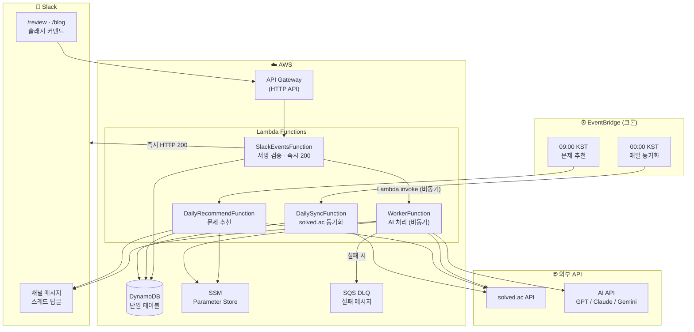

# algo-daily-bot


> AWS Lambda 기반 서버리스 슬랙봇 — 매일 백준 문제 추천 + AI 코드 리뷰 + 블로그 초안 자동 생성

알고리즘 학습을 자동화하는 개인용 Slack 봇입니다. 매일 아침 solved.ac 기반으로 백준 문제를 추천하고, `/review` 커맨드로 AI 코드 리뷰를, `/blog` 커맨드로 풀이 블로그 초안을 생성합니다. GPT / Claude / Gemini 중 원하는 AI를 Lambda 재배포 없이 런타임에 전환할 수 있습니다.

---

## 기능

| 기능                | 설명                                                               |
| ------------------- | ------------------------------------------------------------------ |
| 📅 일일 문제 추천   | 매일 09:00 KST에 solved.ac 기반 백준 문제를 Slack 채널에 자동 게시 |
| 🔍 AI 코드 리뷰     | `/review` 슬래시 커맨드로 문제 맥락 + 정답 여부를 포함한 AI 리뷰   |
| ✍️ 블로그 초안 생성 | `/blog` 슬래시 커맨드로 알고리즘 풀이 블로그 초안 자동 생성        |
| 🔄 풀이 자동 동기화 | 매일 00:00 KST에 solved.ac 풀이 목록 자동 갱신                     |

---

## 아키텍처



---

## 기술 스택

| 분류             | 기술                                                        |
| ---------------- | ----------------------------------------------------------- |
| **런타임**       | Node.js 20.x (TypeScript), ARM64 Lambda                     |
| **IaC**          | AWS SAM (esbuild 번들링)                                    |
| **데이터베이스** | DynamoDB 단일 테이블 설계                                   |
| **스케줄링**     | EventBridge Scheduler (ScheduleV2)                          |
| **AI**           | OpenAI GPT / Anthropic Claude / Google Gemini (런타임 전환) |
| **시크릿**       | AWS SSM Parameter Store                                     |
| **문제 소스**    | solved.ac 비공식 API                                        |
| **모니터링**     | CloudWatch Logs + SQS DLQ 알람                              |
| **테스트**       | Vitest                                                      |

---

## 시작하기

### 사전 요구사항

- AWS CLI 설정 (`ap-northeast-2` 리전 권장)
- AWS SAM CLI 설치
- Node.js 20.x
- [Slack 앱 생성](https://api.slack.com/apps) (스코프: `chat:write`, `commands`)

### 설치 및 배포 (최초 1회)

```bash
# 1. 의존성 설치
npm install && pip3 install aws-sam-translator pyyaml

# 2. 빌드 및 S3 패키징
sam build
sam package --resolve-s3 --s3-prefix algo-daily-bot \
  --output-template-file .aws-sam/packaged-template.yaml \
  --region ap-northeast-2

# 3. 로컬 SAM 변환 후 배포
ACCOUNT_ID=$(aws sts get-caller-identity --query Account --output text)
python3 -c "
import json
from samtranslator.yaml_helper import yaml_parse
from samtranslator.public.translator import ManagedPolicyLoader
from samtranslator.translator.transform import transform
import boto3

with open('.aws-sam/packaged-template.yaml') as f:
    sam_template = yaml_parse(f)
loader = ManagedPolicyLoader(boto3.client('iam', region_name='ap-northeast-2'))
cfn = transform(sam_template, {'AccountId': '${ACCOUNT_ID}', 'Region': 'ap-northeast-2'}, loader)
open('.aws-sam/cfn-transformed.json', 'w').write(__import__('json').dumps(cfn, indent=2))
"

aws cloudformation create-stack \
  --stack-name algo-daily-bot \
  --template-body file://.aws-sam/cfn-transformed.json \
  --capabilities CAPABILITY_IAM CAPABILITY_NAMED_IAM \
  --parameters \
    ParameterKey=SlackChannelId,ParameterValue=C0XXXXXXXXX \
    ParameterKey=ReviewDailyLimit,ParameterValue=10 \
    ParameterKey=BlogDailyLimit,ParameterValue=5 \
  --region ap-northeast-2
# → 완료 후 SlackEventsApiUrl을 메모해두세요
```

> **참고**: `sam deploy --guided`는 일부 AWS 계정에서 SAM Transform 권한 오류가 발생합니다. 위 방식은 로컬에서 변환 후 표준 CloudFormation으로 배포합니다. 자세한 내용은 [troubleshooting.md](docs/troubleshooting.md)를 참조하세요.
>
> **코드 변경 후 재배포**는 `create-stack` 대신 `update-stack`을 사용합니다. 전체 절차는 [RUNBOOK.md](docs/RUNBOOK.md)를 참조하세요.

### SSM 시크릿 설정

```bash
aws ssm put-parameter --name /algo-daily-bot/slack-bot-token \
  --type SecureString --value "xoxb-..."

aws ssm put-parameter --name /algo-daily-bot/slack-signing-secret \
  --type SecureString --value "..."
```

### 초기 데이터 설정

```bash
# BOJ 핸들 등록 + 전체 풀이 캐시 초기화 (약 1~5분 소요)
TABLE_NAME=AlgoDailyBotTable \
ts-node scripts/sync.ts --slack-user-id <Slack_User_ID> --handle <BOJ_핸들>
```

### AI 제공자 설정

```bash
# 지원 제공자: gpt | claude | gemini
TABLE_NAME=AlgoDailyBotTable \
ts-node scripts/setup-ai.ts --provider gpt --model gpt-4o-mini --api-key sk-...
```

| 제공자    | `--provider` | 모델 예시                               |
| --------- | ------------ | --------------------------------------- |
| OpenAI    | `gpt`        | `gpt-4o-mini`, `gpt-4o`                 |
| Anthropic | `claude`     | `claude-haiku-4-5`, `claude-sonnet-4-6` |
| Google    | `gemini`     | `gemini-2.0-flash`, `gemini-1.5-pro`    |

AI 제공자 변경 시 `setup-ai.ts`를 다시 실행하면 됩니다. **Lambda 재배포 불필요.**

### Slack 앱 설정

1. [Slack 앱 설정](https://api.slack.com/apps)에서 슬래시 커맨드 등록:
   - `/review` → `<SlackEventsApiUrl>`
   - `/blog` → `<SlackEventsApiUrl>`

2. Bot Token Scopes 확인: `chat:write`, `commands`

---

## 슬래시 커맨드 사용법

### `/review` — AI 코드 리뷰

BOJ 문제 번호가 필수입니다. `solved` / `failed`로 정답 여부를 알려주면 더 정확한 피드백을 받습니다.

````
/review 1753 solved ```
def dijkstra(n, graph):
    import heapq
    dist = [float('inf')] * (n + 1)
    ...
```
````

````
/review 1753 failed ```
def dijkstra(n, graph):
    ...
```
````

- 문제 번호: 필수 (solved.ac에서 제목·난이도·태그 자동 조회)
- `solved|failed`: 선택 (생략 시 정답 여부 없이 코드 리뷰)
- 언어 태그 불필요 — ` ``` ` 그대로 사용
- 최대 3,000자 / 일일 10회 제한

### `/blog` — 블로그 초안 생성

문제 번호와 코드를 넣으면 solved.ac에서 문제 정보를 자동 조회해 프롬프트에 포함합니다:

````
/blog 1753 ```
def dijkstra(n, graph):
    ...
```
````

자유 텍스트로도 사용 가능합니다:

```
/blog 백준 1932번 정수 삼각형 DP 풀이
```

- 일일 5회 제한
- 결과는 스레드 답글에 마크다운 형식으로 게시

---

## 문서

| 문서 | 설명 |
|---|---|
| [user-guide.md](docs/user-guide.md) | 전체 설치·설정·사용법 상세 가이드 |
| [RUNBOOK.md](docs/RUNBOOK.md) | 운영 런북 (재배포·모니터링·장애 대응) |
| [CONTRIB.md](docs/CONTRIB.md) | 개발 환경 설정·스크립트·기여 가이드 |
| [PRD.md](docs/PRD.md) | 제품 요구사항 정의서 |
| [architecture/overview.md](docs/architecture/overview.md) | 시스템 아키텍처 개요 |
| [architecture/data-flow.md](docs/architecture/data-flow.md) | 데이터 흐름 및 DynamoDB 테이블 설계 |
| [troubleshooting.md](docs/troubleshooting.md) | 배포 오류 해결 (SAM Transform 권한 등) |
| [cold-start-optimization.md](docs/cold-start-optimization.md) | Lambda 콜드 스타트 측정 및 최적화 기록 |
| [adr/](docs/adr/) | 아키텍처 결정 기록 (ADR) |

---

## 개발

```bash
npm test              # 단위 테스트
npm run test:coverage # 커버리지 포함
npm run lint          # ESLint
sam local invoke DailyRecommendFunction -e events/schedule.json  # 로컬 테스트
```

---

## 모니터링

- **WorkerDLQ 알람**: DLQ에 메시지가 쌓이면 CloudWatch 알람 발생
- **로그**: CloudWatch Logs (`/aws/lambda/algo-daily-bot-*`)

---

## 성능

> 상세 측정 결과 및 최적화 과정은 [cold-start-optimization.md](docs/cold-start-optimization.md)를 참고하세요.

v1.2에서 4가지 최적화(esbuild Minify, 메모리 조정, 예열 트리거, CloudWatch 로그 보존)를 적용했습니다.

**핵심 개선 요약:**
- 번들 크기 전 함수 **~50% 감소** → 콜드 스타트 단축
- `DailySyncFunction` 콜드 스타트 **331ms → 243ms (-27%)**
- `WorkerFunction` 메모리 **512MB → 256MB** (실사용 대비 과할당 해소)
- `DailyRecommendFunction` 예열 트리거로 매일 09:00 실행 시 **콜드 스타트 0ms** 기대
- `SlackEventsFunction` · `DailySyncFunction` 메모리 **256MB → 128MB**, GB-초 기준 비용 **~34% 절감**

### Before / After 비교 (v1.1 → v1.2)

| 함수 | 콜드 스타트 Before | 콜드 스타트 After | 메모리 Before | 메모리 After | 번들 크기 Before | 번들 크기 After |
|------|----------------:|----------------:|------------:|------------:|---------------:|---------------:|
| `WorkerFunction` (`/review`) | 471ms | **418ms** ↓11% | 512MB | **256MB** | 3.2MB | **1.65MB** |
| `WorkerFunction` (`/blog`) | 451ms | **378ms** ↓16% | 512MB | **256MB** | 3.2MB | **1.65MB** |
| `SlackEventsFunction` | 416ms | **414ms** | 256MB | **128MB** | 2.5MB | **1.25MB** |
| `DailyRecommendFunction` | 399ms | 408ms* | 256MB | **256MB** | 2.2MB | **1.09MB** |
| `DailySyncFunction` | 331ms | **243ms** ↓27% | 256MB | **128MB** | 1.1MB | **0.53MB** |

*예열 트리거 적용으로 실제 09:00 실행 시 Init Duration **0ms** 기대

---

## 라이선스

MIT
