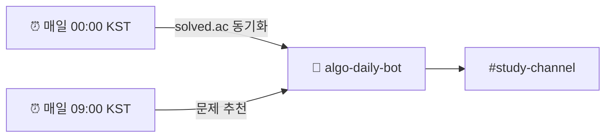
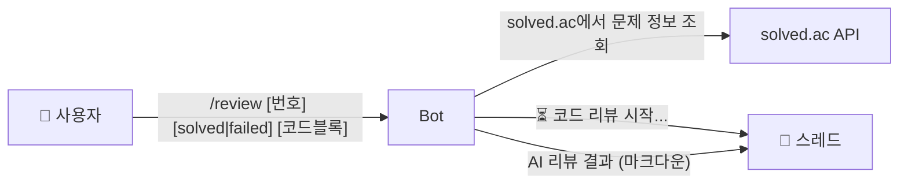
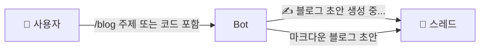
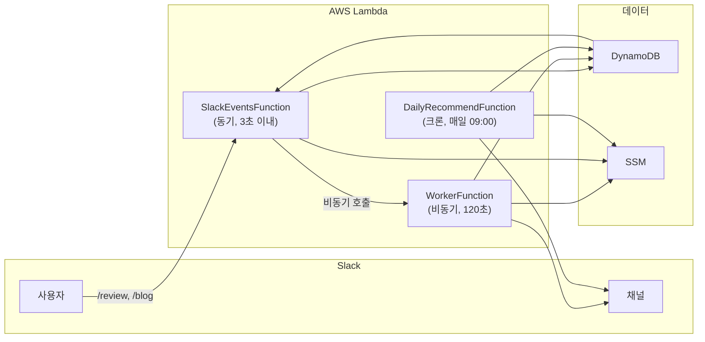
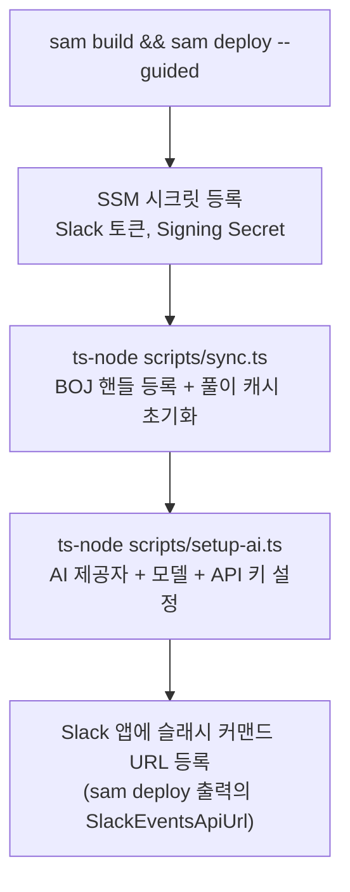

# 제품 요구사항 정의서 (PRD)

**프로젝트**: algo-daily-bot
**버전**: v1.0
**작성일**: 2026-02-22

---

## 1. 제품 개요

### 목적

알고리즘 학습을 일상화하기 위한 Slack 기반 자동화 봇입니다. 매일 백준 문제를 추천하고, AI를 통해 코드 리뷰와 블로그 초안 작성을 지원합니다.

### 대상 사용자

- 알고리즘 스터디 그룹 또는 개인 학습자
- Slack을 주요 커뮤니케이션 도구로 사용하는 개발자
- 백준 온라인 저지(BOJ) 사용자

---

## 2. 핵심 기능

### 기능 A: 일일 문제 추천



**동작 방식**:

- 매일 자정 00:00 KST에 solved.ac에서 풀이 이력 자동 동기화 (추천 제외 목록 최신화)
- 매일 오전 09:00 KST에 자동 실행
- 이전에 추천하지 않은 문제 선택 (중복 제거)
- 사용자가 이미 푼 문제 제외 (solved.ac 캐시 활용)
- 난이도 범위: Gold V ~ Gold I (레벨 11~15, 설정 가능)
- 5회 시도 후 신규 문제가 없으면 한국어 알림 메시지 전송

**Slack 메시지 형식**:

```
🧩 *오늘의 백준 문제*

*[Gold IV] 최단 경로*
🔗 https://boj.kr/1753
태그: 다익스트라, 최단 경로
```

---

### 기능 B: AI 코드 리뷰 (`/review`)



**사용법**:

````
/review 1753 solved ```python
def dijkstra(n, graph):
    ...
```
````

````
/review 1753 failed ```python
def dijkstra(n, graph):
    ...
```
````

**파싱 규칙**:

| 필드 | 필수 여부 | 설명 |
|------|-----------|------|
| `번호` | 필수 | BOJ 문제 번호. solved.ac API로 제목·난이도·태그 조회 |
| `solved\|failed` | 선택 | 생략 시 AI가 정답 여부 없이 코드만 리뷰 |
| 코드블록 | 필수 | 3중 백틱으로 감싼 코드 |

**입력 조건**:
- 코드는 반드시 3중 백틱(` ``` `)으로 감싸야 합니다
- 최대 3,000자 이내
- 언어 태그 선택 사항 (` ```python`, ` ```java` 등)

**AI 리뷰 항목**:
1. 문제 조건 기반 정확성 검증 (엣지 케이스 포함)
2. 시간/공간 복잡도 (Big-O)
3. 코드 스타일 (가독성, 변수명)
4. (`failed` 시) 오류 원인 집중 분석
5. (`solved` 시) 최적화 및 대안 풀이 제안

**제한**:
- 사용자별 일일 최대 10회 (기본값, 환경변수로 조정 가능)

---

### 기능 C: 블로그 초안 생성 (`/blog`)



**사용법**:

```
/blog 백준 1753번 최단 경로 풀이
```

또는 코드와 함께:

```
/blog 다익스트라 알고리즘 분석 [java 코드블록]
```

**생성 형식**:

```
# [문제 제목]

## 문제 설명
## 풀이 접근법
## 코드 분석
## 복잡도 분석
## 배운 점
```

**제한**:

- 사용자별 일일 최대 5회 (기본값)
- 응답 3,900자 초과 시 분할 게시

---

## 3. 비기능 요구사항

### 성능

| 항목                | 목표                                      |
| ------------------- | ----------------------------------------- |
| Slack 응답 시간     | 3초 이내 (즉시 확인 메시지 + 비동기 처리) |
| AI 처리 시간        | 최대 120초                                |
| 일일 추천 실행 시간 | 60초 이내                                 |

### 가용성

- Lambda 서버리스: AWS 관리형 가용성
- AI API 장애 시: 한국어 오류 메시지 Slack 스레드에 게시
- WorkerFunction 완전 실패 시: DLQ → CloudWatch 알람

### 보안

- Slack 서명 검증: HMAC-SHA256 + 타임스탬프 (5분 만료)
- 시크릿 관리: AWS SSM Parameter Store (SecureString) 런타임 조회
- 멱등성: trigger_id 기반 중복 요청 방지 (24시간 TTL)

### 비용 (월간 예상)

| 서비스      | 예상 비용                 |
| ----------- | ------------------------- |
| Lambda      | 프리 티어 내 (< $0.01)    |
| DynamoDB    | PAY_PER_REQUEST (< $1)    |
| API Gateway | 프리 티어 내              |
| SQS         | 프리 티어 내              |
| SSM         | 무료 (Standard Parameter) |
| **합계**    | **~$1/월 이하**           |

---

## 4. 시스템 아키텍처 요약

자세한 내용은 [architecture/overview.md](./architecture/overview.md)를 참조하세요.



---

## 5. 기술 스택

| 카테고리 | 기술                                           |
| -------- | ---------------------------------------------- |
| 런타임   | Node.js 20.x (ARM64)                           |
| 언어     | TypeScript (strict)                            |
| IaC      | AWS SAM                                        |
| AI       | OpenAI / Anthropic / Google (런타임 전환 가능) |
| 데이터   | DynamoDB (단일 테이블)                         |
| 외부 API | solved.ac (비공식), Slack Web API              |
| 테스트   | Vitest + aws-sdk-client-mock                   |

---

## 6. v1 범위 및 제외 사항

### v1 포함

- [x] 일일 문제 추천 (단일 사용자)
- [x] `/review` 슬래시 커맨드 (범용 리뷰)
- [x] `/blog` 슬래시 커맨드
- [x] 멱등성, 요청 제한, 중복 제거
- [x] DLQ + CloudWatch 알람

### v1.1 예정

- [ ] 매일 00:00 KST solved.ac 자동 동기화 Lambda
- [ ] `/review [번호] [solved|failed]` — 문제 맥락 + 정답 여부 기반 리뷰

### v2 이후 고려

- [ ] 다중 사용자 일일 추천 (GSI2 프로필 구조로 준비됨)
- [ ] Slack 앱 홈(App Home) UI
- [ ] 문제 난이도 사용자별 커스터마이징
- [ ] 주간/월간 통계 리포트

---

## 7. 초기 설정 순서



자세한 내용은 [runbook/deployment.md](./runbook/deployment.md)를 참조하세요.
