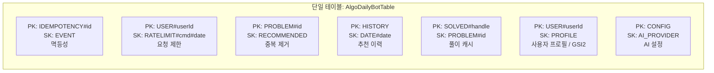

# ADR-0002: DynamoDB 단일 테이블 설계

- **날짜**: 2026-02-22
- **상태**: 승인됨

## 맥락

데이터 저장소로 관계형 DB(RDS)와 NoSQL(DynamoDB)를 검토했습니다. DynamoDB를 선택한 후, 테이블 설계 방식(단일 테이블 vs 다중 테이블)을 결정해야 했습니다.

## 결정

**DynamoDB 단일 테이블 설계**를 채택합니다.

## 단일 테이블 키 구조

## 이유

### DynamoDB 선택 이유 (vs RDS)

| 항목 | DynamoDB | RDS |
|------|----------|-----|
| 비용 | PAY_PER_REQUEST (소량 사용 시 거의 무료) | 인스턴스 상시 비용 |
| 운영 | 완전 관리형, 서버리스 | 패치, 백업, 스케일링 필요 |
| Lambda 통합 | VPC 불필요, IAM 인증 | VPC 설정 필요 |
| 스케일링 | 자동 | 수동 |

### 단일 테이블 선택 이유

1. **비용**: 테이블당 GSI 비용이 발생하므로 하나의 테이블로 통합합니다.
2. **Lambda 당 1개 연결**: Lambda에서 DynamoDB 클라이언트를 1개만 관리합니다.
3. **액세스 패턴 명확**: 이 서비스의 모든 쿼리는 PK+SK 포인트 조회 또는 GSI 조회로 충분합니다.

### TTL 활용

- 멱등성 레코드: 24시간 후 자동 삭제
- 요청 제한 레코드: KST 자정 이후 자동 삭제

## 트레이드오프

- **복잡성**: 단일 테이블 설계는 처음에는 직관적이지 않습니다. `constants.ts`의 `KEY` 객체로 키 구성을 표준화하여 완화합니다.
- **쿼리 유연성 제한**: 복잡한 집계/조인이 필요한 경우 부적합합니다. 현재 서비스는 해당 쿼리가 없습니다.
- **배치 쓰기 부분 실패**: `BatchWriteCommand`는 UnprocessedItems를 반환할 수 있어, 지수 백오프 재시도 로직을 구현했습니다.
