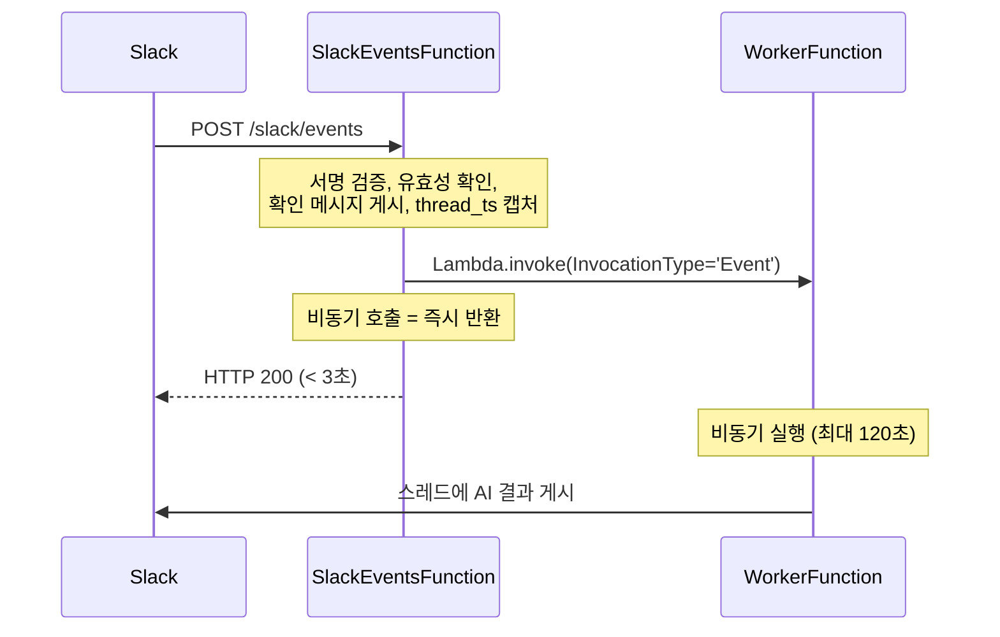
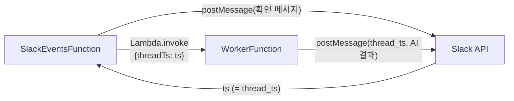

# ADR-0003: Slack 3초 제한 대응 — 비동기 Lambda 패턴

- **날짜**: 2026-02-22
- **상태**: 승인됨

## 맥락

Slack 슬래시 커맨드는 **3초 이내에 HTTP 응답**을 받지 못하면 타임아웃 오류를 표시합니다. AI API 호출(GPT, Claude, Gemini)은 일반적으로 5~30초가 소요됩니다. 이 두 요구사항이 충돌합니다.

## 결정

**SlackEventsFunction + WorkerFunction 2단계 비동기 패턴**을 채택합니다.

## 이유

### 대안 비교

| 방법 | 설명 | 문제점 |
|------|------|--------|
| 동기 처리 | SlackEventsFunction에서 AI 직접 호출 | Slack 3초 타임아웃 |
| Slack response_url | 3초 후 response_url로 POST | 30분 제한, 5회 제한 |
| SQS + Lambda | SQS에 메시지 → Worker Lambda | SQS 폴링 지연 (수 초) |
| **Lambda.invoke(Event)** | 비동기 Lambda 직접 호출 | **없음** |

### Lambda.invoke(Event) 선택 이유

1. **지연 없음**: SQS 폴링 지연 없이 즉시 WorkerFunction을 시작합니다.
2. **thread_ts 캡처 가능**: SlackEventsFunction이 먼저 `chat.postMessage`로 확인 메시지를 게시하고, 응답 `ts`를 WorkerFunction에 전달합니다. 이를 통해 AI 결과를 같은 스레드에 답글로 게시합니다.
3. **단순성**: SQS, SNS 등 추가 서비스 없이 Lambda만으로 구현됩니다.

### thread_ts 캡처 흐름

## 트레이드오프

- **오류 가시성**: WorkerFunction은 비동기이므로 SlackEventsFunction에서 오류를 잡을 수 없습니다. WorkerFunction 내부에서 Slack 스레드에 한국어 오류 메시지를 직접 게시합니다.
- **DLQ 필요**: WorkerFunction의 완전한 실패(Slack 게시도 불가)는 SQS DLQ로 라우팅하고 CloudWatch 알람으로 감지합니다.
- **재시도 없음**: `MaximumRetryAttempts: 0`으로 설정합니다. AI API 일시 오류 시 사용자가 재시도하는 방식을 선택했습니다 (중복 실행 방지).
