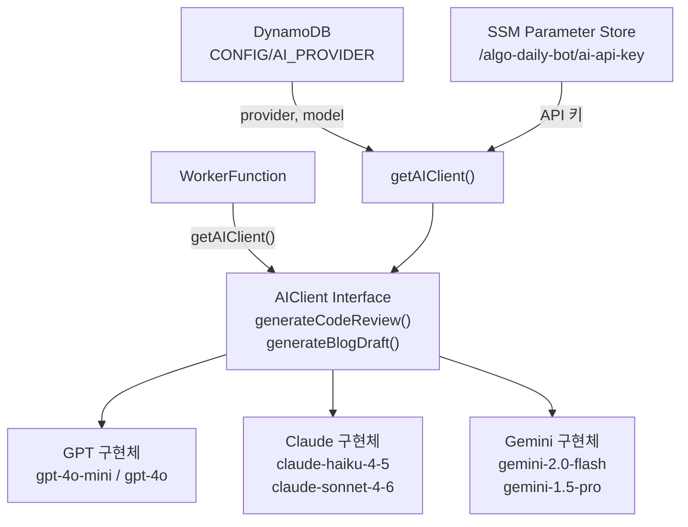

# ADR-0004: 런타임 AI 제공자 선택 (GPT / Claude / Gemini)

- **날짜**: 2026-02-22
- **상태**: 승인됨

## 맥락

AI 코드 리뷰와 블로그 초안 생성에 사용할 AI 제공자를 선택해야 했습니다. 초기에는 GPT-4o-mini 단독 사용을 검토했으나, 제공자를 런타임에 교체할 수 있도록 추상화하기로 결정했습니다.

## 결정

**AIClient 인터페이스를 통한 런타임 제공자 교체 가능 구조**를 채택합니다. 기본값은 GPT-4o-mini이며, DynamoDB 설정과 `scripts/setup-ai.ts`를 통해 언제든 변경할 수 있습니다.

## AI 제공자 추상화 구조



## 이유

### 단일 제공자 고정 방식의 문제점

- API 가격, 성능, 가용성이 시간에 따라 변합니다.
- GPT-4o가 출시되거나 Claude 4가 나오면 코드를 변경해야 합니다.
- 팀마다 보유한 API 크레딧이 다를 수 있습니다.

### 런타임 전환 방식의 장점

1. **배포 없이 전환**: `setup-ai.ts` 실행만으로 제공자/모델을 변경합니다.
2. **비용 최적화**: 가성비가 높은 제공자를 즉시 선택할 수 있습니다.
3. **API 장애 대응**: 특정 제공자 장애 시 즉시 다른 제공자로 전환합니다.

### 모듈 레벨 캐싱

Lambda 웜 컨테이너에서 DynamoDB + SSM 조회를 매 요청마다 반복하지 않도록, `getAIClient()`는 모듈 레벨에서 클라이언트를 캐싱합니다.

```typescript
// 첫 번째 호출: DynamoDB + SSM 네트워크 2회
// 이후 호출: 캐시에서 즉시 반환
let _aiClient: AIClient | null = null;
export async function getAIClient(): Promise<AIClient> {
  if (_aiClient) return _aiClient;
  // ...초기화
  _aiClient = factory();
  return _aiClient;
}
```

## 제공자별 특징

| 제공자 | 추천 모델 | 특징 |
|--------|-----------|------|
| GPT (OpenAI) | gpt-4o-mini | 비용 대비 성능 우수, 코드 이해력 높음 |
| Claude (Anthropic) | claude-haiku-4-5 | 긴 컨텍스트, 상세한 분석 |
| Gemini (Google) | gemini-2.0-flash | 빠른 응답, 멀티모달 지원 |

## 제공자 변경 방법

```bash
TABLE_NAME=AlgoDailyBotTable \
  ts-node scripts/setup-ai.ts \
  --provider claude \
  --model claude-haiku-4-5 \
  --api-key sk-ant-...
```

## 트레이드오프

- **추상화 오버헤드**: 단순한 단일 제공자 대비 구조가 복잡합니다. 하지만 `aiClient.ts` 한 파일에 모두 캡슐화되어 다른 코드에 영향이 없습니다.
- **모델 검증 없음**: 어떤 모델명이든 입력 가능합니다. 잘못된 모델명은 런타임에 AI API 오류로 나타납니다.
