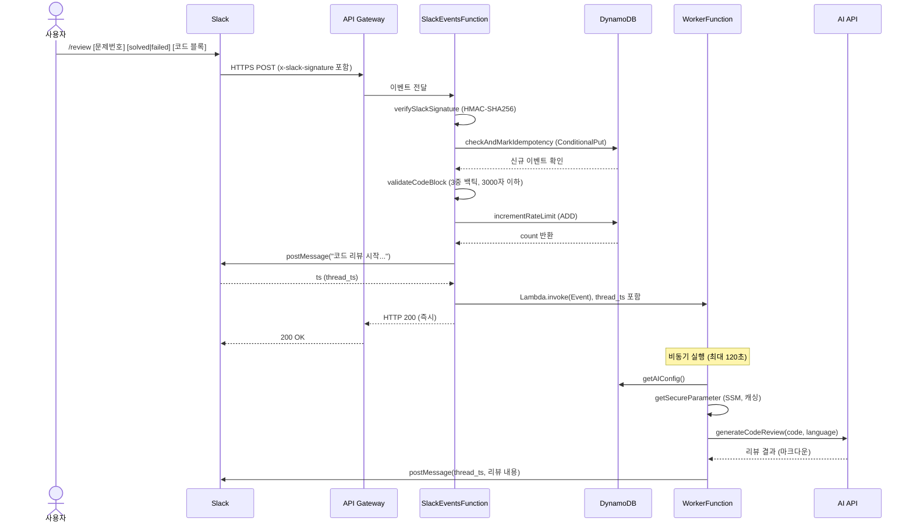
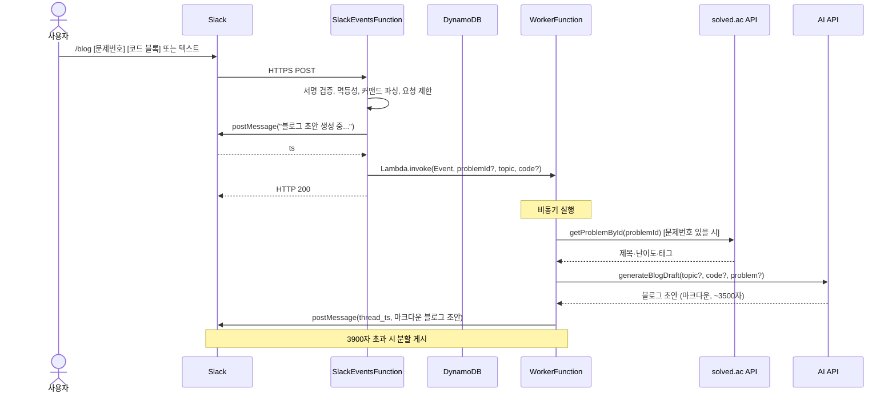
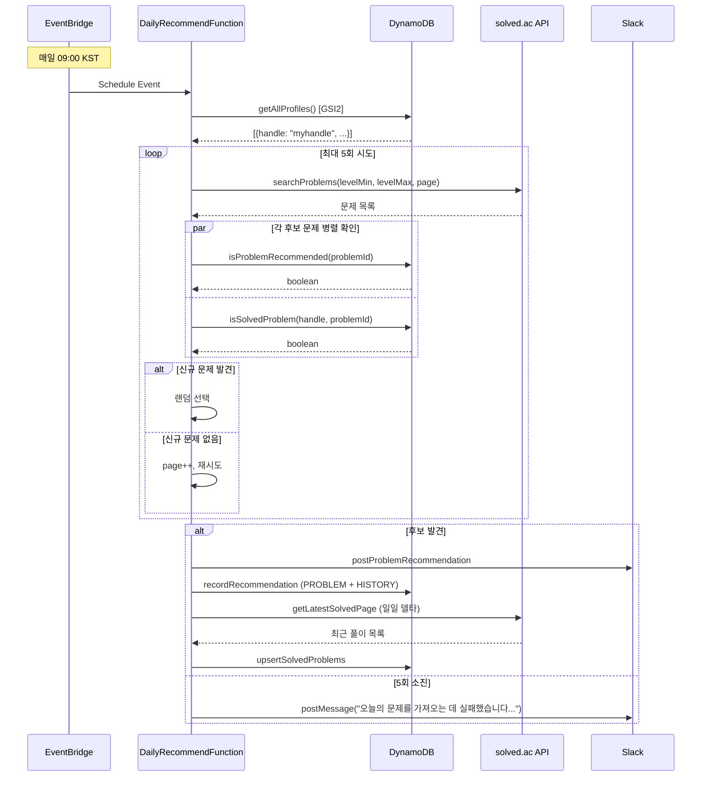
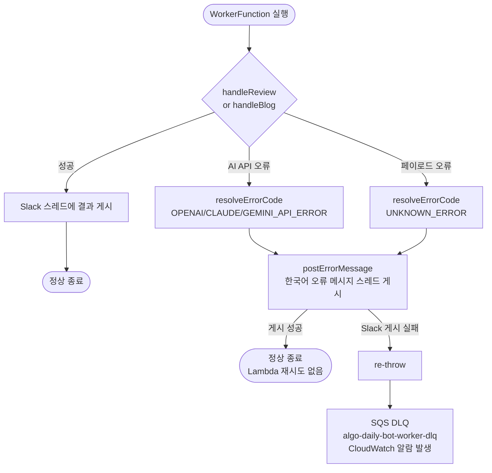

# 데이터 흐름

## /review 커맨드 흐름

```mermaid
sequenceDiagram
    actor User as 사용자
    participant Slack as Slack
    participant APIGW as API Gateway
    participant SEF as SlackEventsFunction
    participant DDB as DynamoDB
    participant WF as WorkerFunction
    participant AI as AI API

    User->>Slack: /review [문제번호] [solved|failed] [코드 블록]
    Slack->>APIGW: HTTPS POST (x-slack-signature 포함)
    APIGW->>SEF: 이벤트 전달

    SEF->>SEF: verifySlackSignature (HMAC-SHA256)
    SEF->>DDB: checkAndMarkIdempotency (ConditionalPut)
    DDB-->>SEF: 신규 이벤트 확인
    SEF->>SEF: validateCodeBlock (3중 백틱, 3000자 이하)
    SEF->>DDB: incrementRateLimit (ADD)
    DDB-->>SEF: count 반환

    SEF->>Slack: postMessage("코드 리뷰 시작...")
    Slack-->>SEF: ts (thread_ts)
    SEF->>WF: Lambda.invoke(Event), thread_ts 포함
    SEF-->>APIGW: HTTP 200 (즉시)
    APIGW-->>Slack: 200 OK

    Note over WF: 비동기 실행 (최대 120초)
    WF->>DDB: getAIConfig()
    WF->>WF: getSecureParameter (SSM, 캐싱)
    WF->>AI: generateCodeReview(code, language)
    AI-->>WF: 리뷰 결과 (마크다운)
    WF->>Slack: postMessage(thread_ts, 리뷰 내용)
```

## /blog 커맨드 흐름

```mermaid
sequenceDiagram
    actor User as 사용자
    participant Slack as Slack
    participant SEF as SlackEventsFunction
    participant DDB as DynamoDB
    participant WF as WorkerFunction
    participant SA as solved.ac API
    participant AI as AI API

    User->>Slack: /blog [문제번호] [코드 블록] 또는 텍스트
    Slack->>SEF: HTTPS POST
    SEF->>SEF: 서명 검증, 멱등성, 커맨드 파싱, 요청 제한
    SEF->>Slack: postMessage("블로그 초안 생성 중...")
    Slack-->>SEF: ts
    SEF->>WF: Lambda.invoke(Event, problemId?, topic, code?)
    SEF-->>Slack: HTTP 200

    Note over WF: 비동기 실행
    WF->>SA: getProblemById(problemId) [문제번호 있을 시]
    SA-->>WF: 제목·난이도·태그
    WF->>AI: generateBlogDraft(topic?, code?, problem?)
    AI-->>WF: 블로그 초안 (마크다운, ~3500자)
    WF->>Slack: postMessage(thread_ts, 마크다운 블로그 초안)
    Note over WF,Slack: 3900자 초과 시 분할 게시
```

## 일일 문제 추천 흐름

```mermaid
sequenceDiagram
    participant EB as EventBridge
    participant DRF as DailyRecommendFunction
    participant DDB as DynamoDB
    participant SA as solved.ac API
    participant Slack as Slack

    Note over EB: 매일 09:00 KST
    EB->>DRF: Schedule Event

    DRF->>DDB: getAllProfiles() [GSI2]
    DDB-->>DRF: [{handle: "myhandle", ...}]

    loop 최대 5회 시도
        DRF->>SA: searchProblems(levelMin, levelMax, page)
        SA-->>DRF: 문제 목록

        par 각 후보 문제 병렬 확인
            DRF->>DDB: isProblemRecommended(problemId)
            DDB-->>DRF: boolean
        and
            DRF->>DDB: isSolvedProblem(handle, problemId)
            DDB-->>DRF: boolean
        end

        alt 신규 문제 발견
            DRF->>DRF: 랜덤 선택
        else 신규 문제 없음
            DRF->>DRF: page++, 재시도
        end
    end

    alt 후보 발견
        DRF->>Slack: postProblemRecommendation
        DRF->>DDB: recordRecommendation (PROBLEM + HISTORY)
        DRF->>SA: getLatestSolvedPage (일일 델타)
        SA-->>DRF: 최근 풀이 목록
        DRF->>DDB: upsertSolvedProblems
    else 5회 소진
        DRF->>Slack: postMessage("오늘의 문제를 가져오는 데 실패했습니다...")
    end
```

## WorkerFunction 오류 처리 흐름

```mermaid
flowchart TD
    Start([WorkerFunction 실행]) --> Process

    Process{handleReview<br/>or handleBlog}
    Process -->|성공| PostResult[Slack 스레드에 결과 게시]
    PostResult --> End([정상 종료])

    Process -->|AI API 오류| ResolveCode[resolveErrorCode<br/>OPENAI/CLAUDE/GEMINI_API_ERROR]
    Process -->|페이로드 오류| ResolveCode2[resolveErrorCode<br/>UNKNOWN_ERROR]

    ResolveCode --> PostError[postErrorMessage<br/>한국어 오류 메시지 스레드 게시]
    ResolveCode2 --> PostError

    PostError -->|게시 성공| NormalExit([정상 종료<br/>Lambda 재시도 없음])
    PostError -->|Slack 게시 실패| Rethrow[re-throw]
    Rethrow --> DLQ["SQS DLQ<br/>algo-daily-bot-worker-dlq<br/>CloudWatch 알람 발생"]
```
