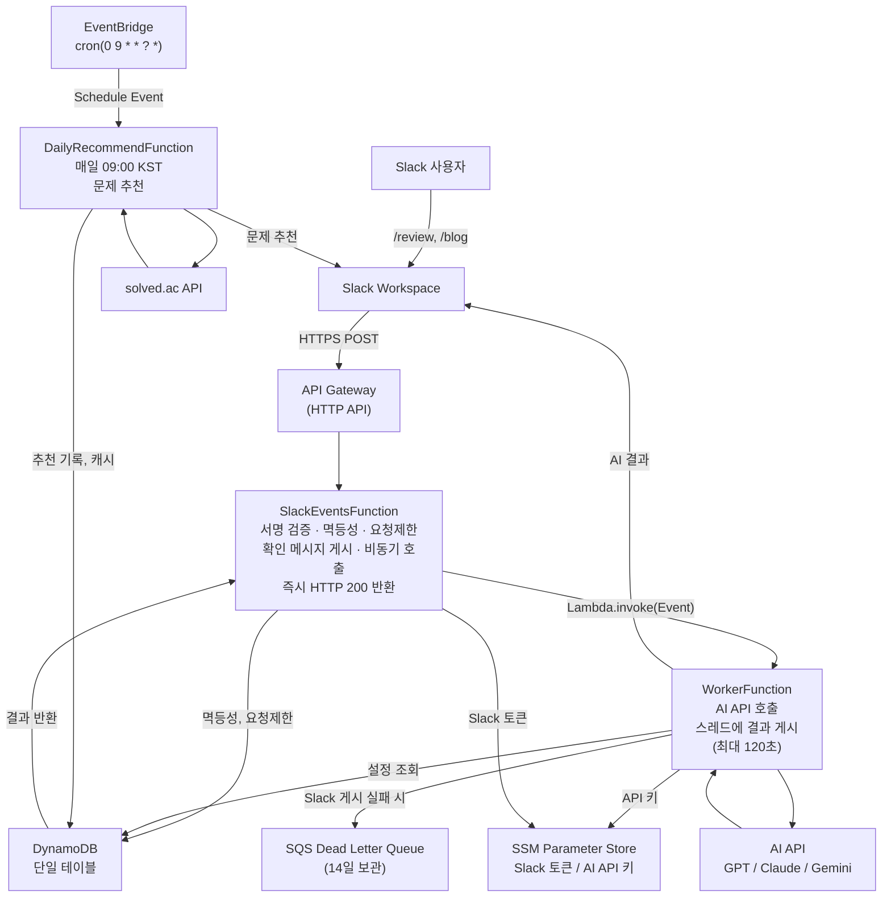
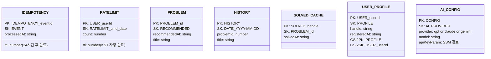

# 시스템 아키텍처 개요

## 전체 구조

## Lambda 함수 구성

| 함수명 | 역할 | 트리거 | 타임아웃 | 메모리 |
|--------|------|--------|--------|--------|
| `SlackEventsFunction` | 커맨드 수신, 검증, Worker 비동기 호출 | API Gateway (HTTP) | 10초 | 256MB |
| `WorkerFunction` | AI API 호출, 결과 스레드 게시 | Lambda.invoke (비동기) | 120초 | 512MB |
| `DailyRecommendFunction` | 매일 백준 문제 추천 | EventBridge Cron | 60초 | 256MB |

## 공유 인프라

| 서비스 | 용도 | 비고 |
|--------|------|------|
| DynamoDB | 단일 테이블 (멱등성, 요청 제한, 풀이 캐시, AI 설정) | PAY_PER_REQUEST |
| SQS | Worker Dead Letter Queue | MaximumRetryAttempts: 0 |
| SSM Parameter Store | Slack 토큰, AI API 키 (SecureString) | 런타임 조회 |
| CloudWatch | 로그, DLQ 알람 | DLQ 메시지 >= 1 시 알람 |

## DynamoDB 단일 테이블 키 구조

## 아키텍처 핵심 결정 사항

- **Slack 3초 제한 대응**: SlackEventsFunction이 즉시 200을 반환하고, WorkerFunction을 비동기 호출 → [ADR-0003](../adr/0003-async-lambda-pattern-for-slack.md)
- **단일 테이블 설계**: DynamoDB 비용 최소화 → [ADR-0002](../adr/0002-dynamodb-single-table-design.md)
- **서버리스 선택**: 사용량 기반 과금, 운영 부담 없음 → [ADR-0001](../adr/0001-use-lambda-over-ec2.md)
- **AI 제공자 추상화**: GPT/Claude/Gemini 런타임 전환 가능 → [ADR-0004](../adr/0004-claude-api-over-gpt.md)
